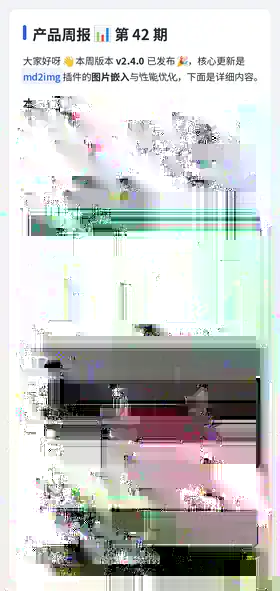

<p align="center">
  
</p>

<h1 align="center">astrbot_plugin_md2img</h1>

<p align="center">
  轻量级、无需浏览器的 AstrBot Markdown 图片渲染插件
</p>

<p align="center">
  长回复 · 表格 · 代码块 · Emoji · LLM 图文混排
</p>

使用 Pillow 直接排版，不依赖浏览器、Playwright 或 HTML 截图环境。适合把 AstrBot 的长回复、复杂表格、代码以及 LLM 图文结果稳定地整理成易读图片发送。

## 效果预览

<p align="center">
  
</p>

<p align="center"><sub>示例：Markdown、表格、代码块、Emoji 与图片组合渲染。</sub></p>

## 功能

- **Markdown 排版**：标题、加粗、斜体、删除线、行内代码、代码块、列表、引用、分割线、链接、表格。
- **中文排版**：中文按字、英文按词换行，并做常见标点避头尾处理。
- **表格优化**：自动收缩字号；过宽表格可拆成独立横屏附图。
- **Agent 感知**：可向 AstrBot Agent 的 system prompt 注入稳定能力声明，让 Agent 知道最终输出层支持 Markdown 图片渲染；不会额外注册 LLM Tool 或制造一次工具调用。
- **图文混排**：可把 LLM 最终 `Plain + Image` 消息链按原顺序嵌入 Markdown 排版，而不是让图片只能单独发送。
- **Emoji**：文本真正包含 Emoji 时才按需加载 Noto Color Emoji；下载后缓存复用。
- **外链图片**：支持 `` 和独占一行的图片 URL；限制数量、体积和像素规模，并拒绝本机/内网目标以降低 SSRF 风险。
- **纯 Pillow**：无需浏览器运行时，部署体积小。

## 安装

从 AstrBot 插件市场安装；开发/测试时也可以在 WebUI 中通过 URL 或 ZIP 手动安装。

首次真正需要渲染且没有可用缓存字体时，插件会下载 Noto Sans SC 到 AstrBot 的插件数据目录。字体不会包含在插件 ZIP 中。下载失败时会尝试使用系统 CJK 字体；也可以通过 `font_path` 指定本机字体。

## 手动使用

```text
/mdimg # 标题
正文 **加粗**
```

也可以回复一条已有消息后发送 `/mdimg`。命令别名只有 `/md2img`，避免占用过于通用的 `/md`、`/markdown`。

## Agent 感知与自动渲染

`agent_awareness` 默认开启。插件会在 `on_llm_request` 阶段向稳定的 system prompt 追加一小段能力说明：Agent 可以正常使用 Markdown 标题、列表、表格、代码块等结构，并知道最终输出层可能把结果渲染成图片。它不会告诉模型去调用一个不存在的 md2img Tool，因此不会多一次 Tool Call。

`auto_render_llm` 默认开启，但只处理 AstrBot 标记为 LLM Result 的结果，不会改写普通插件或普通命令输出：

- 长度达到 `auto_render_min_len`：自动转为图片。
- 包含 Markdown 表格且 `table_always_image=true`：自动转图。
- 较短的纯 Markdown 文本：剥除常见 Markdown 标记后发送纯文本。

## LLM 图片处理模式

`image_handling` 有三档：

| 模式 | 行为 |
| --- | --- |
| `auto` | 推荐。只有当长文本/表格本来就会触发转图时，才把最终消息链中的图片按原位置嵌入排版；短图文回复仍保持 AstrBot 原样。 |
| `embed` | 只要 LLM 最终结果同时包含文字和图片，就强制整合为 Markdown 排版图片。 |
| `separate` | 完全保留 AstrBot 原始图文消息链，图片继续单独发送。 |

图文嵌入只作用于最终 `MessageEventResult.chain` 中的图片。如果其他插件在更早阶段直接调用 `event.send()` 把图片发出，图片已经离开发送流水线，md2img 无法事后收回并合并。

## 主要配置

| 配置 | 默认值 | 说明 |
| --- | ---: | --- |
| `image_width` | 880 | 竖屏图片宽度 |
| `font_size` | 30 | 正文字号 |
| `accent_color` | `#2B5CE6` | 强调色 |
| `max_chars` | 6000 | 单次渲染最大字符数 |
| `font_path` | 空 | 自定义 CJK 字体绝对路径 |
| `font_auto_download` | true | 按需下载 Noto Sans SC |
| `emoji_enabled` | true | 启用彩色 Emoji |
| `emoji_font_path` | 空 | 自定义 Emoji 字体绝对路径 |
| `emoji_auto_download` | true | 有 Emoji 时按需下载 Noto Color Emoji |
| `download_images` | true | 下载并嵌入公网 Markdown 图片 |
| `agent_awareness` | true | 让 Agent 知道输出层支持 Markdown 图片渲染 |
| `image_handling` | `auto` | `auto` / `embed` / `separate` |
| `max_embedded_result_images` | 8 | 最终消息链最多嵌入图片数 |
| `auto_render_llm` | true | LLM 长回复自动转图 |
| `table_always_image` | true | LLM 表格自动转图 |
| `auto_render_min_len` | 220 | 自动转图长度阈值 |
| `landscape_width` | 1600 | 宽表格附图宽度 |
| `table_landscape_ratio` | 1.6 | 宽表格拆图阈值 |

## 字体与网络

中文默认字体固定从 Noto CJK `Sans2.004` 获取，Emoji 默认字体固定从 Noto Emoji `v2.051` 获取。两者都只在需要时下载，并缓存在插件数据目录中，不会在 AstrBot 启动阶段发起网络请求。

如果部署环境完全离线，可以关闭 `font_auto_download` / `emoji_auto_download`，并使用 `font_path` / `emoji_font_path` 指向本地字体。Emoji 字体不可用时会退回普通文本绘制。

## 开源许可

插件代码使用 MIT License。运行时可选下载的 Noto Sans CJK 与 Noto Color Emoji 使用 SIL Open Font License 1.1，详见 `THIRD_PARTY_NOTICES.md`。
